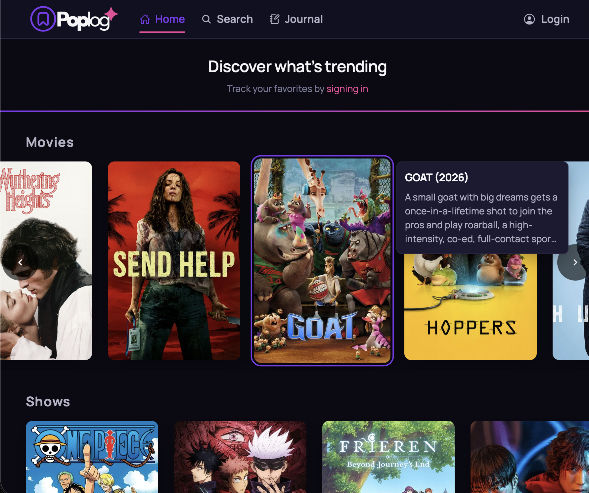
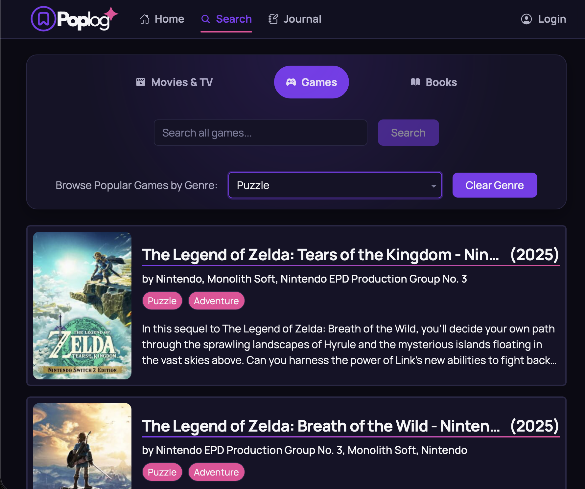
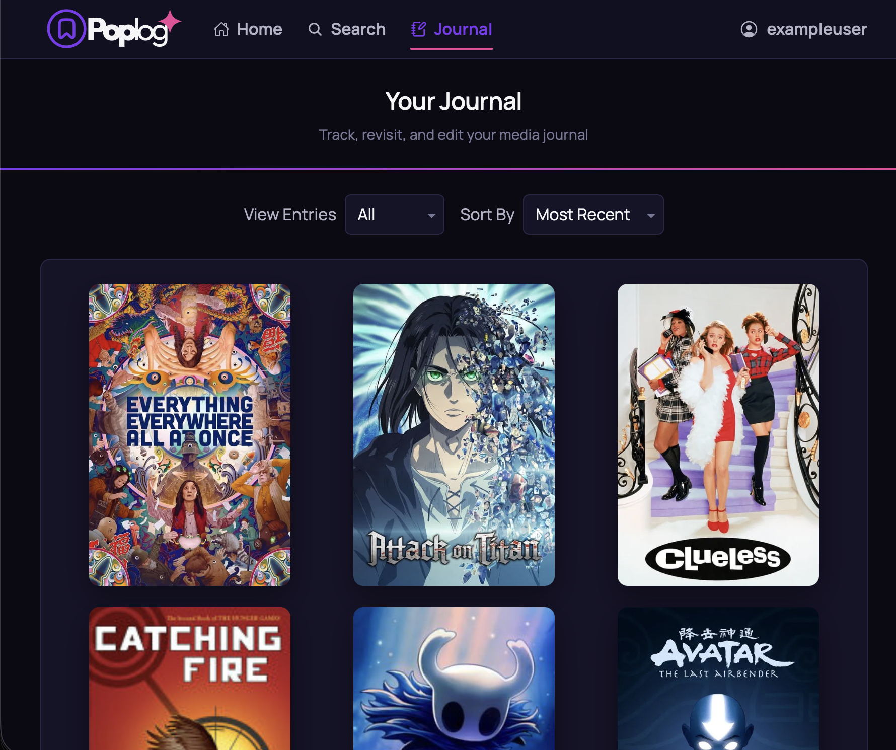
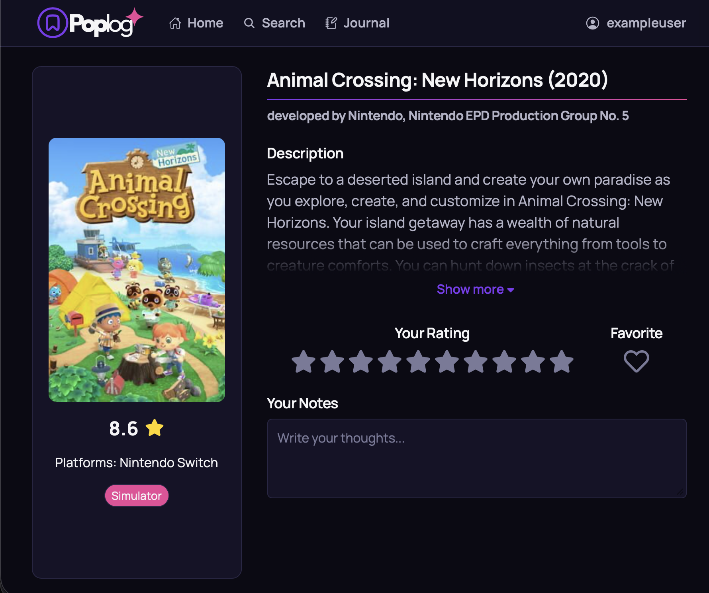

# Poplog

Poplog is a full-stack web application that allows users to discover, track, and manage their favorite movies, TV shows, books, and games in one place.

I created Poplog because I consume a wide range of media and often lose track of my favorite content over time. This project was built as a way to organize and revisit everything in a single, personalized space.

## Live Demo

[Live Demo](https://poplog-app.vercel.app/)

## Screenshots

  
  

  
  

## Features

- Search across multiple media types (movies, TV shows, books, and games)
- Browse trending content from external APIs
- User authentication with protected routes (JWT-based)
- Save media entries and manage them within a journal
- Sync external API data with a PostgreSQL database
- Responsive design for desktop and mobile devices

## Tech Stack

### Client

- React
- React Router
- Javascript
- CSS (Flexbox, responsive design)

### Server

- Node.js
- Express
- PostgreSQL

### APIs

- TMDB (movies & TV)
- Google Books API
- IGDB API (games)
- New York Times Books API

### Deployment & Infrastructure

- Frontend: Vercel
- Backend: Render
- Database: PostgreSQL (hosted on Render)

## What I Learned

- How to design and structure a full-stack application from scratch
- Implementing authentication using JWT and protecting routes
- Integrating and managing multiple third-party APIs
- Designing and querying a PostgreSQL database
- Handling asynchronous data flow and API caching strategies
- Improving user experience with responsive layouts and loading states

## Challenges

- Managing multiple API integrations with different data formats
- Handling authentication state and session persistence
- Preventing redundant API calls through caching
- Coordinating frontend and backend data flow efficiently

## Future Improvements

- Implement a recommendation system
- Add social features (following users, commenting, etc.)
